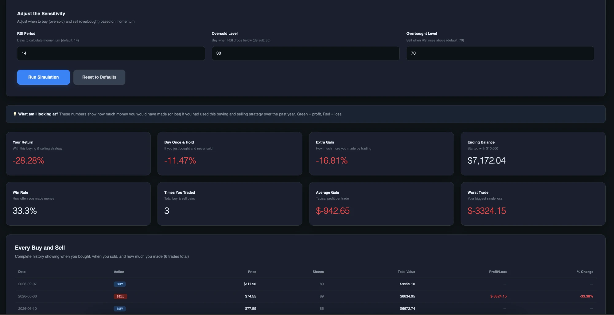
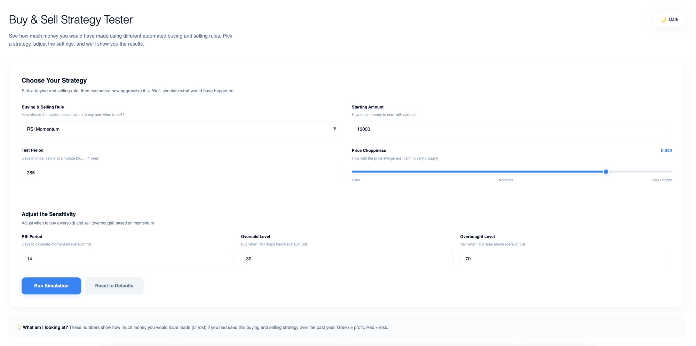
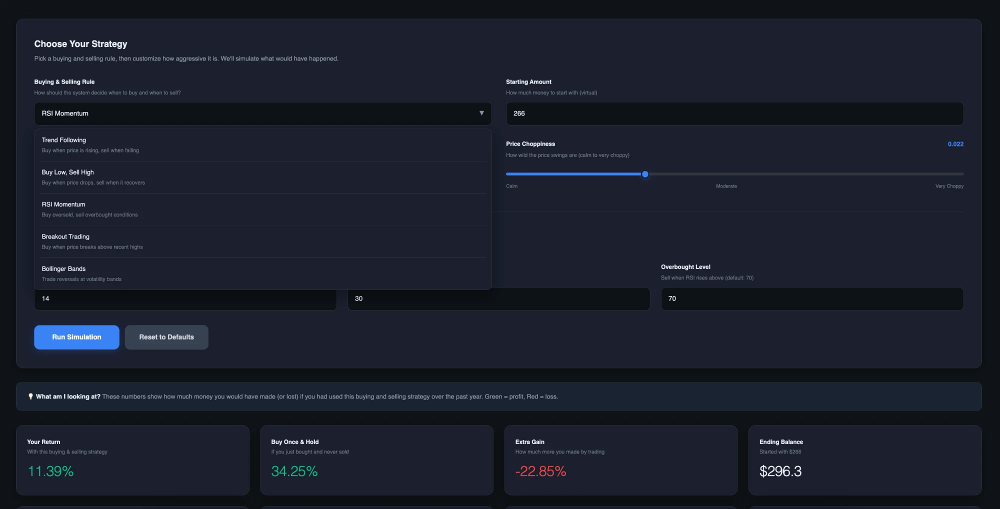

# Trading Strategy Backtester

A backtesting sandbox for five classic trading strategies, built as a single self-contained React component. Pick a strategy, tune its parameters, and see how it would have performed against a buy-and-hold baseline.

**[Try the live demo →](https://arin-deshpande.github.io/quant-strat-backtester/)**



Every strategy runs long-only with all-in position sizing: on a buy signal it converts all available cash into whole shares, and on a sell signal it liquidates the entire position. Any open position is closed at the final price so results are always fully realized.

> **Note:** Price data is randomly generated, not real market data. This is a tool for understanding how strategy logic behaves, not for evaluating whether a strategy would make money.

## Strategies

The app uses plain-language names for each strategy; the standard name comes first below, with the app's label in parentheses.

**Moving Average Crossover** (Trend Following) buys when the short moving average crosses above the long one and sells on the reverse cross. Defaults to a 20-day short window and a 50-day long window.

**Mean Reversion** (Buy Low, Sell High) buys when price falls below a lower band set at some number of standard deviations under the rolling mean, then sells once price recovers back above the mean. Defaults to a 20-day lookback and a 2σ band.

**RSI Momentum** buys when RSI drops below the oversold threshold and sells when it climbs above the overbought threshold. Defaults to a 14-period RSI with thresholds at 30 and 70.

**Breakout** (Breakout Trading) buys when price exceeds the recent high plus a buffer scaled to the recent range, and sells when it drops under the recent low minus the same buffer. Defaults to a 20-day period and a 0.1 multiplier.

**Bollinger Bands** buys when price touches the lower band and sells when it touches the upper band. Defaults to a 20-day period and a 2σ width.

Mean Reversion and Bollinger Bands share the same band construction but differ on the exit: mean reversion sells on a return to the average, Bollinger holds until the opposite band.

Three settings apply to every run regardless of strategy — the length of the generated series (365 days), starting capital ($10,000), and volatility (0.02).

## Output

Each run shows eight metrics: your return, the buy-and-hold return over the same series, the extra gain (alpha) as the difference between them, ending balance, win rate, number of round-trip trades, average profit per trade, and the worst single trade. Below the metrics is a full trade log listing date, buy or sell, price, share count, total value, and per-trade profit or loss.

## Screenshots

**Choosing a strategy and settings (light mode)**



**Strategy picker (dark mode)**



Both light and dark themes are available from the toggle in the top right.

## Price generation

Prices follow a geometric random walk. Each step multiplies the previous price by `1 + trend + shock`, where `shock` is drawn uniformly from `±volatility` and `trend` defaults to a slight upward drift of 0.0001. There is no mean reversion, no volatility clustering, and no fat tails, so the series is smoother and better behaved than real returns.

Because data is regenerated on every run, results vary run to run for identical parameters. Treat a single run as one sample, not as a measurement.

## Running it

Requires Node.js 20.19+ or 22.12+.

```bash
npm install
npm run dev
```

Then open the local URL Vite prints (usually http://localhost:5173). `npm run build` creates a production build in `dist/`.

## Project structure

- `src/QuantBacktest.jsx`: the whole backtester, including price generation, the five strategies, metrics, and UI
- `src/main.jsx`: mounts the component
- `index.html` and `vite.config.js`: the Vite app shell

The component is self-contained, so you can also drop `src/QuantBacktest.jsx` into another React 18+ app:

```jsx
import QuantBacktest from './QuantBacktest';

function App() {
  return <QuantBacktest />;
}
```

It loads Tailwind from a CDN at mount. Theme preference persists to `localStorage` under `quant-backtest-theme`.

## Known limitations

- **No transaction costs.** No commissions, spread, or slippage. Fills happen at the exact closing price of the signal bar, which flatters high-turnover strategies most.
- **Long-only, all-in.** No shorting, no partial positions, no risk-based sizing.
- **No risk-adjusted metrics.** Sharpe ratio and maximum drawdown aren't computed, so a strategy that returns 15% through a violent path looks identical to one that returns 15% smoothly.
- **Single realization.** Metrics come from one generated path rather than a distribution across many.
- **O(n × window) moving averages.** The MA, mean reversion, and Bollinger loops re-slice and re-reduce the full window at each step instead of maintaining a rolling sum. Fine at 365 days; noticeable well before 10,000.

## License

MIT
